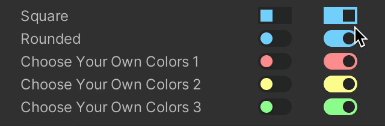

# Switch

**Requires [Odin Inspector](https://odininspector.com/)**. 

**Draws a configurable switch instead of Unity's default toggle.**



### Installation

Simply put the downloaded `SwitchAttribute.cs` file in your project and start using the attribute as shown in the examples. **Do not put the attribute in an Editor folder or the attribute will be removed during build, causing errors**. If you need/want to put it in an Editor folder you'll have to put the attribute definition in a separate file.


### Examples

```csharp
public class SomeMonoBehaviour : MonoBehaviour
{
    // Simply add the Switch attribute.
    
    [Switch]
    public bool SomeBool;
    
    
    // You can provide custom colors for the switch using Odin's ValueResolvers.
    // The switch's color will be determined by the background color if you don't set a specific one.
    // By default the background will be set to a dark grey while off and to a light blue while on.
    
    [Switch("bgColorOn", "bgColorOff", "switchColorOn", "switchColorOff")]
    public bool CustomColors;

    public Color bgColorOn = new Color(0.6f, 1f, 0.6f);
    public Color bgColorOff = new Color(0.165f, 0.165f, 0.165f);
    public Color switchColorOn = new Color(0.165f, 0.165f, 0.165f);
    public Color switchColorOff = new Color(0.6f, 1f, 0.6f);
    
    // You can change the aligment of the switch to left, right, or center
    // and make it a square switch by setting rounded to false.
    
    [Switch(SwitchAlignment.Center, rounded: false)]
    public bool SquareSwitch;
}
```
